# Nebula - The Ultimate Productivity App for Students 🚀
---
[Visit NEBULA](https://nebula0.vercel.app/)
  
Nebula is a **feature-rich productivity app** designed specifically for students. It provides a seamless online document editor, a collaborative friend system, and a fast, no-sign-in chat feature called **Nexus**. Manage, share, and edit documents with ease while customizing your profile and workspace to fit your style.
  
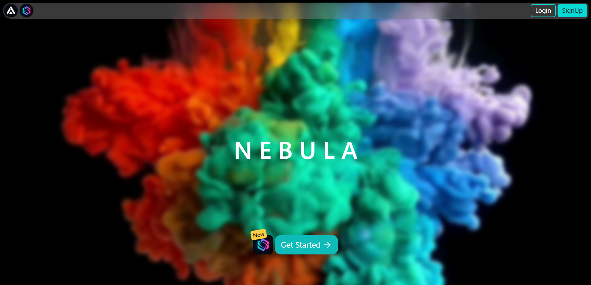
 
[Visit NEBULA](https://nebula0.vercel.app/)

---

## 🌟 Features

## 📊 Dashboard – Your Productivity Hub  

The **dashboard** is the central hub of Nebula, giving you quick access to all essential features:  
  

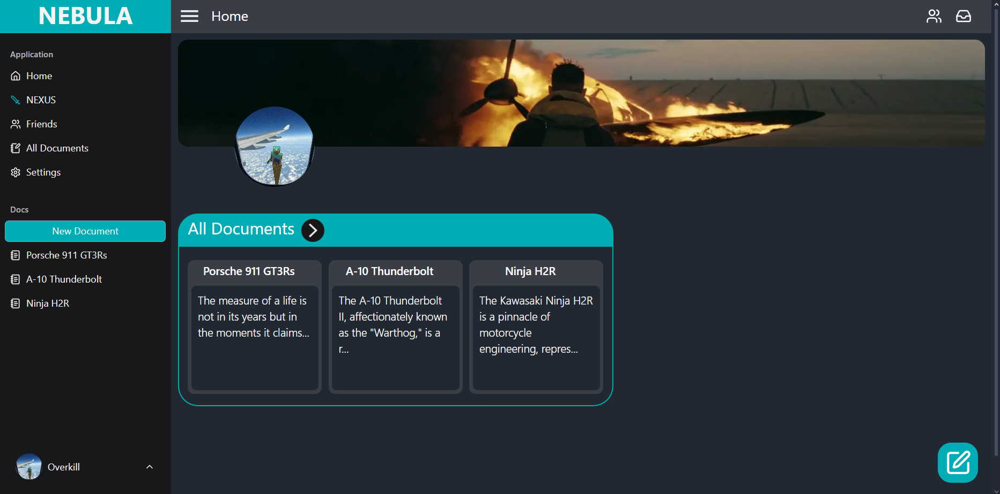

- **📁 All Documents:** View, create, rename, and delete your documents easily.  
- **👥 Friends & Collaboration:** Manage friend requests and shared documents.  
- **🎨 Customization:** Personalize your **profile** (name, username, bio, profile picture) and **theme settings**.  
- **🚀 Quick Access:** Navigate seamlessly between your documents, settings, and Nexus.  

Designed for efficiency, the dashboard ensures you stay organized and productive with minimal effort.  

---
### 📄 **Online Document Editor**
 

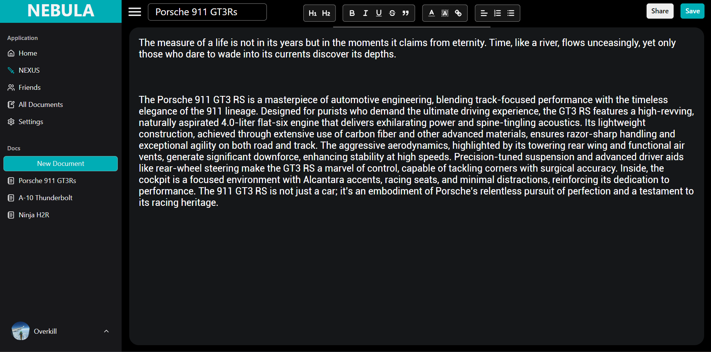
- A **rich text editor** to create and format documents.
- Save and manage all documents in one place.
- **Rename, delete, and organize** documents effortlessly.
---
### 📂 **All Documents Management**
 

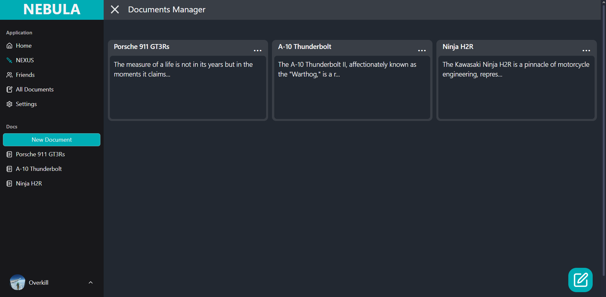

- View all your documents in one place.
- Perform **deletion, renaming, and creation** of new documents.
---
### 🤝 **Friend System**
 

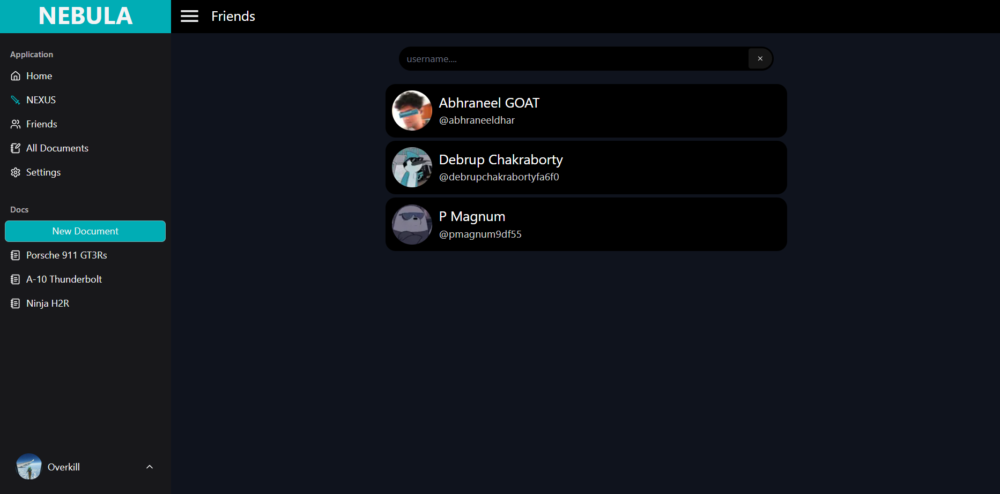
- Send and receive **friend requests**.
- Accept or reject incoming requests.
 

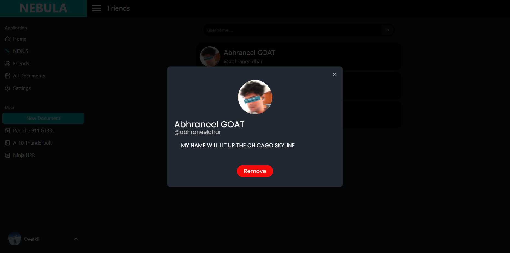

---
**Collaborate by sharing documents** with friends.
  

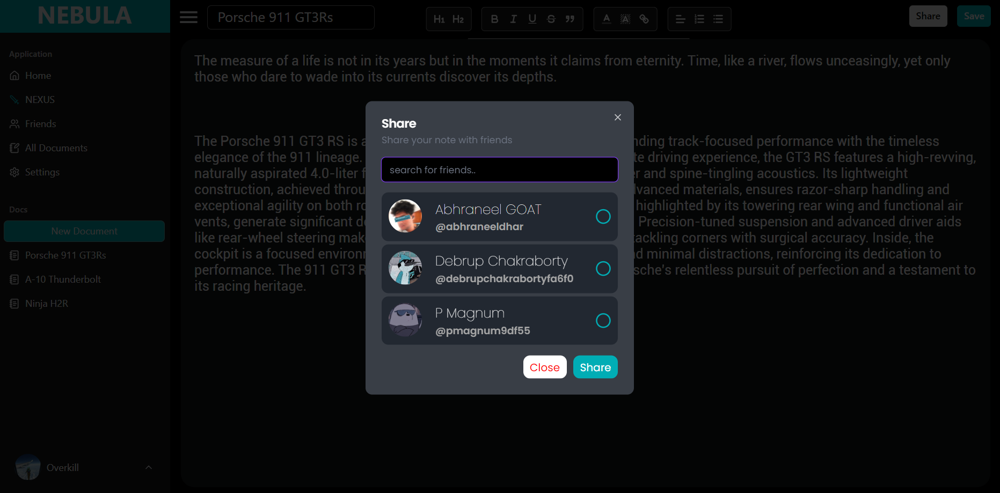
- Accept or reject shared documents from others.
---
### ⚙️ **Settings & Customization**
 

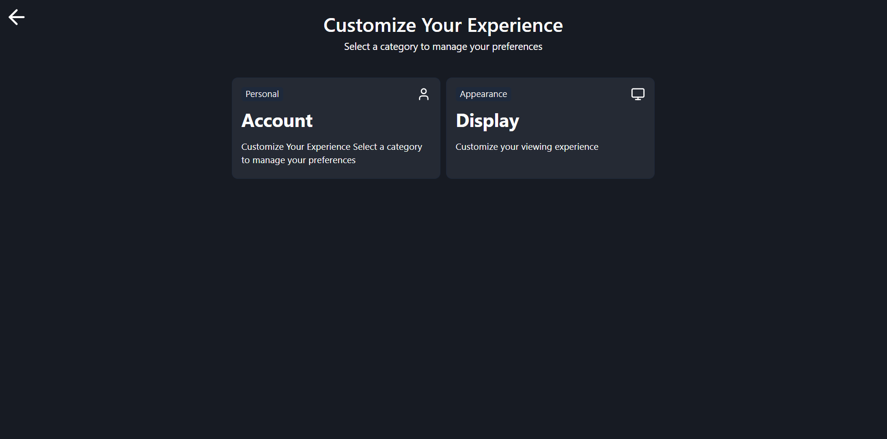

- **Profile customization**: Change your **name, username, bio, and profile picture**.
   

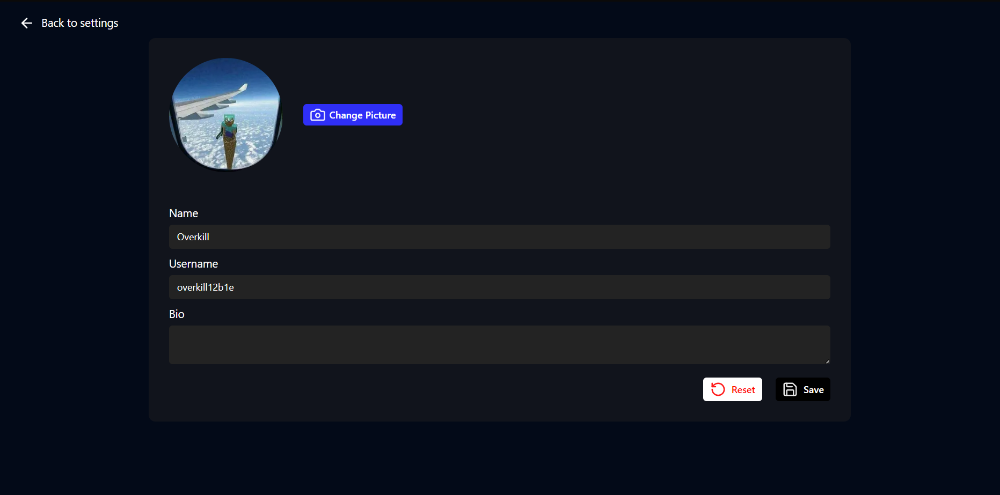

- **Image cropping**: Upload and crop your profile picture before saving.
  

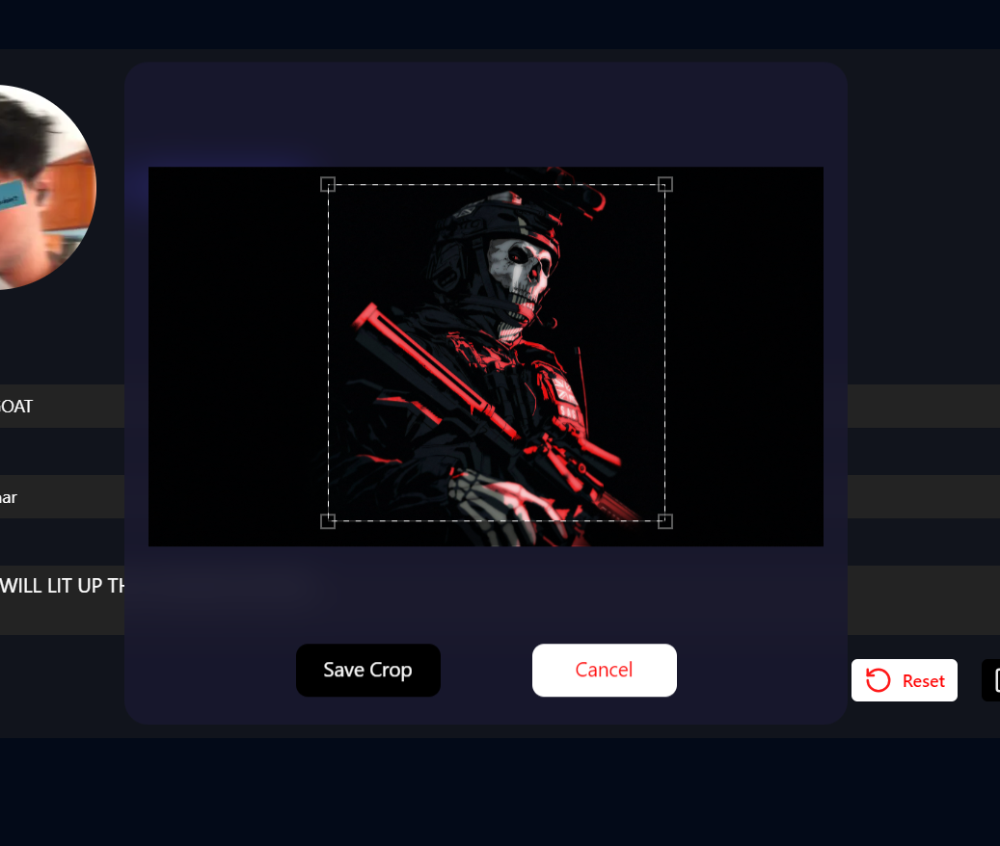
- **Theme settings**: Switch between light and dark themes.
   

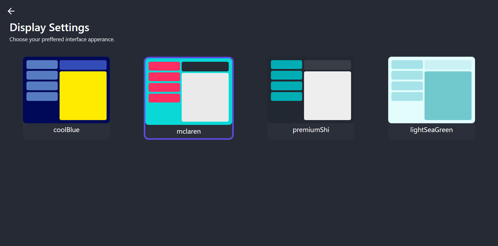

---

### 💬 **Nexus - Instant Chat Rooms**
 

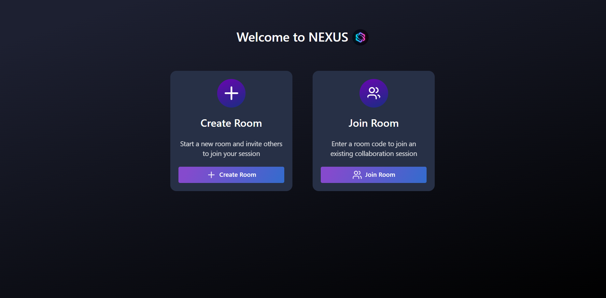

- No sign-in required for quick and **anonymous communication**.
   

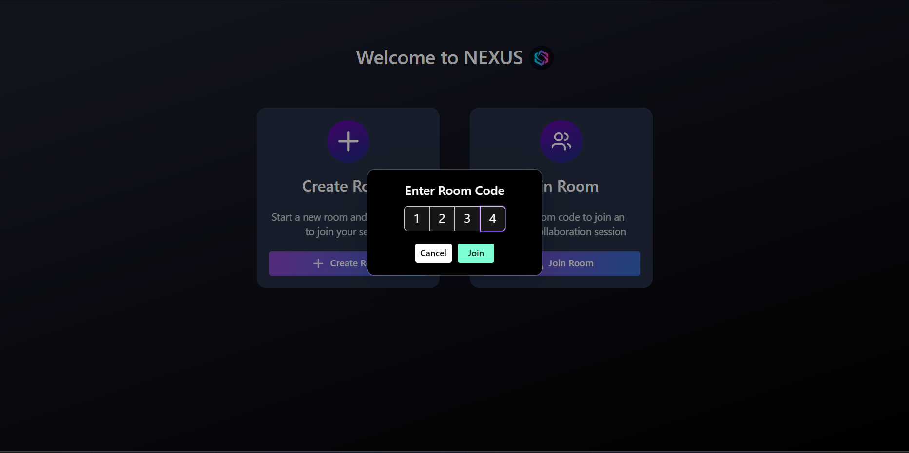

- Open a **temporary chat room** to share text between multiple devices.
   

---

## 🛠️ Tech Stack
 

Nebula is built using modern technologies to ensure a **fast, secure, and scalable** experience:
  

- **Next.js** – for frontend and server-side rendering.
- **MongoDB** – for storing user and document data.
- **TypeScript** – for type safety.
- **Supabase** – for cache requests and real-time database features.
- **React** – for a smooth and dynamic user interface.
- **NextAuth** – for secure authentication and user management.

---
  

## 📌 Future Plans
- **Real-time document collaboration**
- **Task and to-do list integration**
- **More themes and UI customization**
- **AI-powered writing assistant**

---

**A Trex Corp Product**

