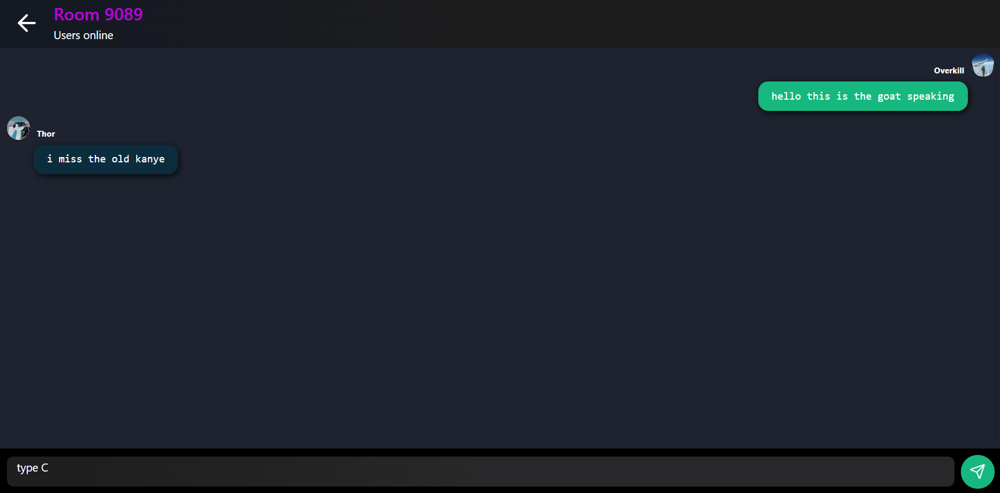

# Nebula - The Ultimate Productivity App for Students 🚀

Nebula is a **feature-rich productivity app** designed specifically for students. It provides a seamless online document editor, a collaborative friend system, and a fast, no-sign-in chat feature called **Nexus**. Manage, share, and edit documents with ease while customizing your profile and workspace to fit your style.

---

## 🌟 Features
---  
## 📊 Dashboard – Your Productivity Hub  

The **dashboard** is the central hub of Nebula, giving you quick access to all essential features:  

- **📁 All Documents:** View, create, rename, and delete your documents easily.  
- **👥 Friends & Collaboration:** Manage friend requests and shared documents.  
- **🎨 Customization:** Personalize your **profile** (name, username, bio, profile picture) and **theme settings**.  
- **🚀 Quick Access:** Navigate seamlessly between your documents, settings, and Nexus.  

Designed for efficiency, the dashboard ensures you stay organized and productive with minimal effort.  

### 📄 **Online Document Editor**

- A **rich text editor** to create and format documents.
- Save and manage all documents in one place.
- **Rename, delete, and organize** documents effortlessly.

### 🤝 **Friend System**

- Send and receive **friend requests**.
- Accept or reject incoming requests.
  

- **Collaborate by sharing documents** with friends.

- Accept or reject shared documents from others.

### ⚙️ **Settings & Customization**

- **Profile customization**: Change your **name, username, bio, and profile picture**.
- **Image cropping**: Upload and crop your profile picture before saving.
- **Theme settings**: Switch between light and dark themes.

### 📂 **All Documents Management**

- View all your documents in one place.
- Perform **deletion, renaming, and creation** of new documents.

### 💬 **Nexus - Instant Chat Rooms**

- No sign-in required for quick and **anonymous communication**.

- Open a **temporary chat room** to share text between multiple devices.

---

## 🛠️ Tech Stack

Nebula is built using modern technologies to ensure a **fast, secure, and scalable** experience:

- **Next.js** – for frontend and server-side rendering.
- **MongoDB** – for storing user and document data.
- **TypeScript** – for type safety and better development experience.
- **Supabase** – for authentication and real-time database features.
- **React** – for a smooth and dynamic user interface.
- **NextAuth** – for secure authentication and user management.

---

## 📌 Future Plans
- **Real-time document collaboration**
- **Task and to-do list integration**
- **More themes and UI customization**
- **AI-powered writing assistant**

---

**A Trex Corp Product**

